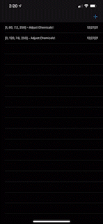

# Hot-Tub-Time
An iOS app to for testing hot tub water. 
This simple app tracks your test strip readings.

Time spent: **4** hours spent in total

## User Stories

The following functionality is completed:

- [x] User can view list of all test strips
- [x] User can add test strip to list
- [x] User can remove test strip from list
- [x] User can view details of a test strip on the list
- [x] User can keep data from previous uses of app

Future features:

- [ ] User can use camera to add a new strip
- [ ] User recieves a notification when time to add chemicals

## Video Walkthrough

Here is a walkthrough of implemented user stories:

